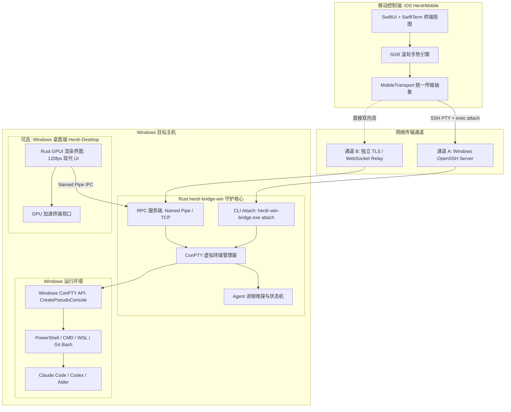
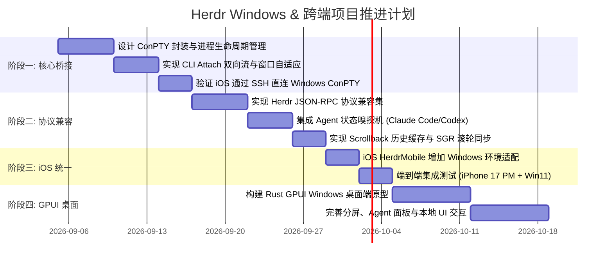

# Herdr 跨平台体系架构规划：Windows 转发服务与 iOS 全端协同

> **文档状态**：规划设计 / 架构提案  
> **面向系统**：Windows 10/11 (ConPTY), macOS, Linux, iOS (HerdrMobile)  
> **核心技术栈**：Rust, ConPTY, `portable-pty`, `tokio`, Swift, SwiftUI, SwiftTerm, GPUI (Zed)

---

## 1. 背景与核心诉求

### 1.1 现状与痛点
1. **官方 `herdr` 对 Windows 远端的支持缺失**：
   - 目前 `herdr` 官方仅支持 Linux 和 macOS 作为 Remote Host（被控远端）。
   - 官方明确说明 *“Windows is not supported as a remote target host”*，原因在于其底层核心的 `attach`、`streamlocal` 以及多路复用机制重度依赖 POSIX 系统调用（`openpty`、`termios`、Unix Process Groups 以及通过 Unix Domain Socket 进行的 `SCM_RIGHTS` 文件描述符传递），这些在 Windows NT 内核中完全没有对应实现。
2. **多平台 AI 终端治理碎片化**：
   - 现代开发者经常同时拥有 macOS、Linux 服务器以及高性能 Windows 主机（配置本地大模型、运行大型开发环境或 CUDA 任务）。
   - 用户在 Windows 上同样高频运行各类 Coding Agent（如 Claude Code、Codex CLI、Aider、Agy 等）。
3. **“统一移动端”的刚需**：
   - 用户的核心目标是：**拥有一个统一的 iPhone/iPad 移动端（`HerdrMobile`），无论远端是 Mac、Linux 还是 Windows，都能随时连接、查看 Agent 运行状态、附着到终端、顺畅滚动并交互输入。**

---

## 2. 总体架构图

---

## 3. 构件定位与关键技术方案

### 3.1 转发器核心：`herdr-bridge-win` (Rust 后台守护服务)

Windows 没有 POSIX PTY，但自 Windows 10 (1809+) 引入了 **ConPTY (PseudoConsole API)**，这是 Windows 官方提供的高性能终端子系统，已在 Windows Terminal、WezTerm、Zed 和 VS Code 中得到充分验证。

#### A. 核心技术选型
- **语言**：Rust（高并发、零运行时依赖、内存安全、交叉编译极其友好）。
- **虚拟终端抽象**：`portable-pty`（WezTerm 官方出品的跨平台 PTY 抽象，对 Windows ConPTY 有极其完善的封装与避坑处理）或直接使用 `windows-rs` 绑定 `CreatePseudoConsole` / `ResizePseudoConsole` / `ClosePseudoConsole`。
- **异步运行时**：`tokio`（处理网络连接、Named Pipe、进程 I/O 流转发）。

#### B. 核心职责
1. **ConPTY 会话生命周期管理**：
   - 维护一个包含多个 Pane（窗格）的注册表。
   - 每个 Pane 拥有一个独立的 ConPTY 实例，拉起 PowerShell 7 / Windows Terminal / Agent 命令。
   - 支持动态 `ResizePseudoConsole(hPC, coord)`，以响应手机端屏幕旋转或键盘弹出时的尺寸变化。
2. **多客户端广播与 Attach 劫持 (`--takeover`)**：
   - ConPTY 的输出需要支持多路复用（Multiplexing）：既能保存在服务端的环形滚动缓冲区（Scrollback Buffer），又能实时分发给当前 Attach 上的连接。
   - 当手机端发起 Attach 时，先重放当前屏幕缓冲（Screen Buffer Snapshot），然后进入实时双向流转发。
3. **兼容 Herdr 协议体系**：
   - 导出与 `herdr` 完全一致的 JSON-RPC 规范：
     - `pane.list`、`workspace.list`、`pane.get`
     - `pane.scroll_changed`
     - `pane.agent_status_changed`
     - `pane.resize`、`pane.send_keys`、`pane.send_text`

---

### 3.2 两种连接通道设计：SSH 直连 vs WebSocket Relay

为了兼顾不同网络环境，设计两种传输方案：

| 方案 | 架构原理 | 优势 | 适用场景 |
| :--- | :--- | :--- | :--- |
| **方案 1：OpenSSH Attach 模式（首推，零手机修改）** | Windows 开启自带的 OpenSSH Server。手机通过 SSH 登录后，直接执行 `herdr-bridge attach <pane_id> --takeover`。 | **iOS 客户端无需任何核心改造**，手机完全按连接 Mac/Linux 的方式对待 Windows 主机。 | 局域网、已有 SSH 密钥体系的开发环境。 |
| **方案 2：独立 WebSocket / TLS 模式** | `herdr-bridge-win` 自带轻量异步 Web 监听器，暴露安全 WebSocket 端点。手机直接输入 IP + Token 或局域网 mDNS 自动发现。 | 无需配置 Windows OpenSSH，支持扫码快速配对，极易配合 Tailscale / Cloudflare Tunnel / FRP 进行公网穿透。 | 复杂网络、跳板机环境、不希望开启 Windows SSH 服务的用户。 |

---

### 3.3 Agent 状态机与智能嗅探引擎

Herdr 的一大核心特色是能感知 AI Agent 的状态（`working`, `idle`, `waiting_for_input`, `done`）。在 Windows 下，`herdr-bridge-win` 采用**三重探测机制**：

1. **进程树层级探测**：
   - 调用 Windows Toolhelp32 API (`CreateToolhelp32Snapshot`)，追踪 Shell 衍生的子孙进程（如 `node.exe` 运行的 Claude Code、Python 运行的 Codex / Aider、Rust 运行的 Agy）。
2. **VT/ANSI 输出流模式匹配**：
   - 监听 ConPTY 的原始输出流，匹配 Agent 的典型 ANSI 提示特征（如 Claude Code 的 `Esc[?25l` 动画流、思考动画转轮、`❯ ` 交互等待提示符）。
3. **主动状态广播 Hook**：
   - 预置环境脚本，允许 Agent 通过标准 OSC 序列或 CLI 命令主动上报心跳与状态。

---

### 3.4 终端交互与滚动体验（与 iOS 修复成果无缝对接）

在前一步工作中，我们在 [MobileTerminalView.swift](file:///Volumes/SandE/temp/202609/herdrm/Sources/HerdrMobile/MobileTerminalView.swift) 中为 iOS 端彻底修复了 **Xterm SGR 鼠标滚轮协议**（Button 64/65）。

- Windows 的 ConPTY 原生完全支持并解析 Xterm 鼠标序列（包含 DECSET 1000/1002/1006 SGR 模式）。
- 当用户在 iPhone 上单指或双指滑动时：
  1. iPhone 发送 `\e[<64;col;rowM` / `\e[<65;col;rowM`；
  2. Windows ConPTY 将其作为虚拟滚轮事件投递给底层运行的 Agent / Shell；
  3. 如果是普通长输出，`herdr-bridge-win` 将滚动事件映射为其内置的 Scrollback 偏移量更新并刷新屏幕。
- **效果**：无论在 Windows、Mac 还是 Linux 上，手指在手机屏幕上滑动的物理手感与动量完全一致。

---

### 3.5 Windows 桌面端：基于 Rust GPUI 的现代化 GUI 客户端

对于“Windows 版本你怎么看，是不是可以用 Rust GPUI”，结论是：**极其契合，且是 Windows 桌面开发的最佳技术路径**。

#### A. 为什么不是 Electron / Flutter，而是 GPUI？
- **GPUI (Zed Industries)**：
  - 纯 Rust 编写，由 Zed 团队研发，现已全面支持 Windows (基于 Direct3D 11/12 和 Vulkan)。
  - **GPU 极速渲染**：以 120fps 的流畅度渲染界面，内存占用仅数十 MB（相比 Electron 动辄数百 MB 优势明显）。
  - **原生终端集成**：Zed 本身就是用 GPUI 构建的终端与编辑器，生态内有现成成熟的高性能终端着色与排版机制（基于 `alacritty_terminal`）。
- **定位**：
  - 作为 Windows 平台上的 `HerdrM`。
  - 支持多工作区（Workspaces）、分屏网格（Split Panes）、Agent 实时状态指示、会话快照与本地搜索。

---

## 4. 分阶段实施路线图 (Milestones)

### 阶段一：Rust ConPTY 核心与 SSH Attach 原型 (POC)
- **目标**：在 Windows 上打通“iOS 通过 SSH 连接 Windows 跑 Claude Code 并能顺畅操作终端”。
- **任务清单**：
  1. 创建独立的 Rust 项目 `herdr-bridge-win`。
  2. 使用 `portable-pty` 封装 Windows ConPTY 的创建、销毁、输入输出管道读写。
  3. 提供 `herdr-bridge-win attach` 子命令，将标准 I/O 与 ConPTY 管道对接，并处理终端尺寸变更（SIGWINCH 对应处理）。
  4. 在 iPhone 上的 `HerdrMobile` 中添加 Windows 主机 SSH 配置，测试基础连接与命令输入。

### 阶段二：完整 Herdr 协议栈实现与状态嗅探
- **目标**：实现完整的多 Session/Pane 管理与状态上报，使 iOS 端不仅能附着，还能看列表和状态。
- **任务清单**：
  1. 实现 `pane.list`、`workspace.list`、`pane.focus` 等核心 RPC。
  2. 移植/兼容滚动回滚缓冲区（Scrollback Buffer），支持最多 10,000 行历史存储。
  3. 开发 Windows 进程状态探测器，实时识别当前活跃的 Agent 并在移动端显示为绿色闪烁的 `working` 或蓝色 `idle`。

### 阶段三：iOS 客户端的多平台抹平与优化
- **目标**：一个 iOS 应用无感切换 Mac / Linux / Windows。
- **任务清单**：
  1. 在 `MobileTransport` 中增加环境探针：自动探测远端是 Unix 还是 Windows。
  2. 路径与 Shell 自适应：Windows 下自动使用 PowerShell 7 或用户默认 Shell，兼容 Windows 风格路径（`C:\...`）。
  3. 对齐滚动速度阈值与按键映射（如 Windows 下的 Ctrl 组合键传递）。

### 阶段四：基于 Rust GPUI 的 Windows 桌面端 (Herdr Desktop)
- **目标**：打造 Windows 原生现代 GUI 应用，对齐 macOS 原生 HerdrM 体验。
- **任务清单**：
  1. 搭建 GPUI Windows 项目脚手架。
  2. 实现左侧工作区/会话导航栏、Agent 状态监控卡片、顶部标签栏。
  3. 嵌入 GPU 加速终端视图，通过本地 Named Pipe 与 `herdr-bridge-win` 内部通信。

---

## 5. 风险与应对方案

1. **ConPTY 字符集与双宽字符（CJK）对齐风险**：
   - *风险*：中文、日文等宽字符或 Emoji 在部分 Windows ConPTY 版本下可能存在光标错位。
   - *方案*：启用 UTF-8 代码页（`SetConsoleOutputCP(65001)`），并沿用我们适配过的 SwiftTerm 宽字符宽度计算表。
2. **Windows 僵尸进程与句柄泄漏**：
   - *风险*：手机网络断开时，ConPTY 下拉起的 Agent 进程可能悬挂或异常退出。
   - *方案*：利用 Windows **Job Object**（作业对象）将 ConPTY 及子孙进程加入同一个 Job，一旦 Bridge 异常可由 OS 统一自动回收，杜绝后台游离进程。
3. **网络安全与访问控制**：
   - *风险*：公网暴露端口的安全隐患。
   - *方案*：SSH 方案继承原生 Ed25519 密钥认证；WebSocket 方案强制启用 TLS 1.3 与双向 Token 认证（或直接推荐配合 Tailscale 零信任组网）。

---

## 6. 总结与行动项

本规划将整体工程清晰解耦为：
1. **轻量、聚焦的 Rust 转发核心（Bridge Daemon）**：负责底层 ConPTY 抽象和网络接口，成本低、见效快；
2. **现有的 Swift iOS 客户端（HerdrMobile）**：只需轻微适配即可直接覆盖 Windows，实现“一端控全端”；
3. **前瞻性的 Rust GPUI 桌面客户端**：在 Windows 平台上实现完全不输 macOS 的顶级视觉与操作体验。
