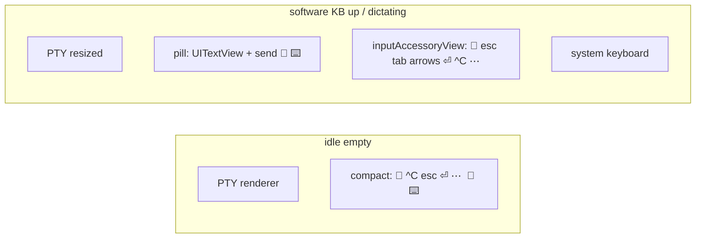
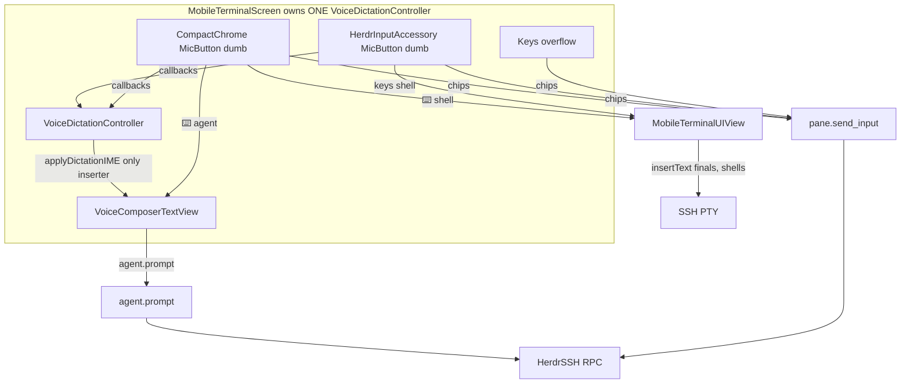

# HerdrMobile iOS input chrome redesign (composer + dictation + key bar)

| Field | Value |
|---|---|
| **Author** | _TBD_ |
| **Date** | 2026-09-06 |
| **Status** | Implemented — dual-focus agent input (2026-09-07) |
| **Scope** | `HerdrMobile` target only (`Sources/HerdrMobile`). No sidebar, SSH, or macOS app changes. |
| **Depends on** | Unreleased Gemini live dictation (`VoiceDictationController`, `GeminiLiveTranscribeClient`) |

---

## Overview

Agent panes intentionally have two input targets. The native `VoiceComposerField` sends reviewed text through `agent.prompt`; the rendered SwiftTerm PTY accepts direct TUI typing through `pane.send_input`. The targets are mutually exclusive: tapping the PTY activates TUI input, while tapping the composer, ⌨️, or starting dictation from composer mode activates the composer.

**Product decision (2026-09-06):** we already have a shortcut toolbar sitting on the system keyboard. Put voice there — **🎤 leftmost** among those keys — and let dictation **type forward** into the current field with **undo**. Then we do **not** need the extra “Tap to dictate” block. Do **not** build a custom `UIInputViewController` / custom keyboard (`inputView`). The original VoiceBarHost-as-`inputView` idea is rejected.

This redesign uses **one keyboard toolbar**: `inputAccessoryView` of the current typing target (composer for an agent prompt, SwiftTerm for agent TUI focus or a shell). It replaces SwiftTerm’s `TerminalAccessory`; toolbars never stack. Dictation follows first responder: composer partials/finals use its IME, whereas agent PTY partials stay in the accessory caption and finals use `pane.send_input` text. Empty native composer stays height-0 until composer input is requested or it has a draft. The agent Send button remains `agent.prompt`; its long-press “Send without newline” remains `pane.send_input` text.

---

## Background & Motivation

### Current state (code, not aspiration)

`MobileTerminalScreen` keeps the composer mounted but collapses it when empty
and inactive. `MobileTerminalHost` carries both focus states:

1. `keyboardShown` requests composer focus on an agent pane or terminal focus on a shell.
2. `ptyIsTypingTarget` requests agent SwiftTerm focus after a PTY tap.
3. `softwareKeyboardVisible` hides the compact row only when one of those targets is actually first responder.

`MobileTerminalUIView` replaces SwiftTerm’s initial `TerminalAccessory` with
the app’s shared `HerdrInputAccessory`. For agent PTY typing it has a nil
`inputView`, so UIKit shows the system keyboard; for selection/copy-only it
uses the zero-height dummy input view. Its `insertText`, `deleteBackward`, and
hardware-key handling call `pane.send_input`, while the delegate drops any
raw SwiftTerm bytes for an agent pane.

The historical stacked-input screen had an always-visible composer,
`VoiceBarHost`, and SwiftTerm’s default `TerminalAccessory`. That arrangement
was removed: there is now one accessory and no docked voice strip.

Dictation now routes by the active first-responder target. Composer focus uses
its marked-text IME. Agent PTY focus sends finals with `pane.send_input` text
and displays partials only in the accessory caption; it never uses SwiftTerm
marked text. Shell finals still call `TerminalView.insertText`.

### Why it hurts

Before the redesign, stacked chrome could consume much of a 390-pt-tall iPhone:

| Surface | Height |
|---|---|
| `keyBar` + padding | ~38 pt |
| empty composer | 36–88 pt |
| `VoiceBarHost` | 44 pt |
| SwiftTerm accessory (if TerminalView focused) | 36 pt (phone) / 48 pt (pad) |
| system keyboard | ~300–336 pt |

Idle chrome alone is ~130–180 pt (~33–45% of the PTY). The 44 pt strip is a **second block** the user does not want: the shortcut toolbar on the keyboard is already the right home for 🎤.

HerdrMobile is display-first (Heeler ADR 0013 as **restated** in the `MobileAttachSession` header and `Claude.md`; not re-verified against `~/Projects/Heeler` in this workspace): the PTY is a renderer; agent text goes through `agent.prompt`; keys go through `pane.send_input`. Copy/select on the PTY is a separate job and must keep working.

### Why dictation is the mobile-primary input

Typing on a phone into a coding agent is slow. Gemini live dictation (`gemini-3.5-transcribe-live`, Keychain via `GeminiAPIKeyStore`) is already in tree: tap-to-toggle on `VoiceDictationController`, hold-to-talk **350 ms arm in `VoiceInputBar.recordTouchDown`** (not on the controller), cwd/title/visible-tail biasing (`DictationContext`), unsent drafts (`ComposerDraftStore`). The job of this redesign is to make that dictation an **IME on the typing target**, housed on the existing shortcut toolbar — not a seventh surface.

---

## Goals & Non-Goals

### Goals

- **One keyboard toolbar:** `inputAccessoryView` of the typing target. 🎤 is the **leftmost** control, then shortcut keys. Do not stack SwiftTerm `TerminalAccessory` + `keyBar` + `VoiceBarHost`.
- Dictation is an IME: partials `setMarkedText`; finals **`insertText` only** (replaces marked text; joins `undoManager`). Never `unmarkText()` then `insertText`.
- Delete `VoiceBarHost` from terminal chrome. No 44 pt “Tap to dictate” strip.
- Exactly one **active typing target at a time**. Agent panes switch between composer and SwiftTerm PTY; shell panes use SwiftTerm.
- Empty native composer height-0 until ⌨️ or dictation. Starting 🎤 focuses the typing target so marked text has somewhere to land.
- Special keys reachable on the compact row (keyboard down) and on the accessory (keyboard up); ⋯ for overflow.
- Preserve paste/attachments, collected-links chip, page up/down, draft persistence, Gemini key/permission flows.
- iPhone and iPad, iOS 18+. Cluster density from `horizontalSizeClass == .regular` (not `UIDevice.userInterfaceIdiom`).

### Non-Goals

- Duplex Voice Mode / Live / spoken agent replies / Live Activities.
- A custom **`UIInputViewController`** or custom keyboard (`inputView`) for dictation or typing. **VoiceBarHost-as-`inputView` is rejected.** A zero-height self-sizing `UIInputView` is used only while an agent PTY is first responder for copy/select, never while it is the typing target (A5; D6).
- Auto-send on pause or on hold-release.
- Using the same SF Symbol for dictation and a future voice-conversation control (`waveform` reserved).
- Vendoring or patching SwiftTerm. Override `inputAccessoryView` / `inputView` on `MobileTerminalUIView`. Our toolbar is a `UIInputView` (same class family as `TerminalAccessory`), not an input-view **controller**.
- Redesigning sidebar, device picker, SSH, macOS `HerdrM`, or herdr protocol.
- An `enum` mode machine. Chrome is boolean composition. Keys-overflow is a modal.

---

## Competitive research

Grounded in in-repo [docs/competitive-voice-composer-ux.md](competitive-voice-composer-ux.md) (researched 2026-09-06; **cited, not re-verified against live ChatGPT/Claude/Grok/Gemini builds in this pass**). HerdrMobile is a **remote agent terminal**, not a chat app. Closest analog: **ChatGPT Codex Remote**. We copy **dictation** UX, not chat-orb UX. This product decision does **not** revive Voice Mode.

### Industry split (ChatGPT, Claude, Grok, Gemini)

| Job | Affordance | Output |
|---|---|---|
| **Dictation** | Mic next to the keys / in the message box | Speech → editable text in **one** field; user reviews; Send |
| **Voice conversation** | Separate waveform / Live control | Spoken back-and-forth |

They do not stack system keyboard + custom keybar + empty extra text box + a third dictation strip.

### What we copy

1. **One composer / one typing field.** We cannot hide the agent’s PTY composer, so we must not add a second *always-visible-height* native box, and we must not add a docked mic strip.
2. **Dictation types into that field** (edit-before-send). Industry apps put the mic on the composer; the user put it on the **shortcut toolbar that already sits on the keyboard** — same job, one chrome.
3. **Hold-to-talk + tap-to-toggle** (already in `VoiceInputBar`). Release = stop, never send.
4. **System keyboard stays the system keyboard.** Special keys + 🎤 are `inputAccessoryView`, never a replacement `inputView`.
5. **Mic ≠ waveform.** Dictation = `mic` / `mic.fill`. Reserve `waveform` for a later conversation mode we are **not** building.

### What we refuse

- Voice Mode.
- Auto-send on silence.
- Custom `inputView` / `UIInputViewController` in place of the system keyboard (CHANGELOG Unreleased already learned first-responder-tied `inputView` dismissed the bar; the user independently rejected rebuilding that).
- Icon collision (Federico Viticci on Codex Remote — cited, not re-verified).

---

## Key Decisions

Each decision cites competitors **and** our PTY / `agent.prompt` constraint. **D11 is the user’s 2026-09-06 call and is final.**

### D11. 🎤 lives on the keyboard toolbar; dictation is an IME; no extra block

**User (2026-09-06):** looking at the iPhone screenshot of the system keyboard plus the shortcut toolbar on it (esc / ctrl / tab / ~ / arrows / …): put voice-input **leftmost** among those keys; after that, dictation should type forward into the current input and the user can undo; then we do not need the extra block; do not build a custom `UIInputViewController`.

**Normative consequences:**

1. **One toolbar** = `inputAccessoryView` of the typing target. Never stack SwiftTerm `TerminalAccessory` + our `keyBar` + `VoiceBarHost`.
2. Accessory contents (agent composer; 36 pt phone / 48 pt pad, matching SwiftTerm):

   ```
   [ 🎤 ] [ esc ] [ tab ] [ ↑ ] [ ↓ ] [ ← ] [ → ] [ ⏎ ] [ ^C ] [ ⋯ ]
   ```

   Shell accessory adds **keyboard-dismiss** (no composer ⌨️-down once compact is hidden).

3. **IME, not a string-concat composer:**
   - Partials: `setMarkedText(_:selectedRange:)` on the first-responder `UITextInput` (same path as CJK composition).
   - Finals: **`insertText` only.** `insertText` **replaces** selected *or marked* text and registers undo. **Never** `unmarkText()` then `insertText` — `unmarkText()` already commits the marked range in place; a following `insertText` duplicates the utterance. (SwiftTerm’s own `unmarkText()` in `iOSTextInput.swift` calls `insertText` on the marked string — another reason not to unmark-then-insert, and not to run this IME against the PTY.)
   - Alternative that is also correct and **not** used: `setMarkedText(final)` then `unmarkText()` with no extra insert. We pick `insertText` only because it is one call and matches `VoiceComposerTextView.insertDictated` today.
   - Spacing: apply the existing “leading space if the unmarked prefix has no trailing space/newline” rule **once**, when a composition **starts** (first `setMarkedText` against committed text, or an unmarked space). Do **not** prefix `spacing + final` on every `.final`.
   - Do **not** concatenate into a Swift `String` binding and assign `uiView.text =` — that kills undo.
   - Do **not** auto-send on pause or hold-release.
4. **Delete `VoiceBarHost` from terminal chrome in PR1** (🎤 leftmost on the **compact** row). The D11 keyboard **accessory** (🎤 leftmost on the system-keyboard toolbar) is **PR3**. Status/errors: a **brief caption on the accessory** (narrow `UILabel`) or a non-blocking toast — not a new 44 pt block and not an empty expanded pill. Until PR3, captions may use a compact one-line label / toast.
5. **Keyboard down:** one compact key row, **🎤 leftmost**, then interrupt/shortcut chips — not a second text box. Starting 🎤 from idle or composer mode focuses the composer so marked text has a home. Starting it while the agent PTY is the target keeps PTY focus; its partials are caption-only and finals type into the TUI. That typically shows the software keyboard; **recommend keep it up** (mic lives on that toolbar in PR3). Whether to hide the keyboard while dictating is **O6**.
6. Never a custom `UIInputViewController`. The accessory is a `UIInputView` of buttons, like `TerminalAccessory`.

### D1. Default chrome is compact; the draft is not a permanent *height*

**Agent pane, idle (no software keyboard, empty draft, not recording):**

```
[ PTY — renderer; tap for TUI typing, long-press for copy/select ]
[ 🎤 ] [ ^C ] [ esc ] [ ⏎ ] [ ⋯ ]     [ link? ] [ 📎 ] [ ⌨️ ]
```

Height target **from PR1** (strip gone): **44 pt** content + existing 8/6 padding ≈ 58 pt, plus home-indicator safe area. Controls do **not** `ignoresSafeArea`. D11 accessory is PR3; PR1 idle is compact-only.

The composer representable stays in the tree at height 0 when collapsed (D2).

**When the draft is expanded** (⌨️, dictation, or unsent committed text): one pill above that row, 36–88 pt, send chevron when committed text is non-empty. 🎤 is **not** duplicated on the pill; it lives on the compact row or the accessory.

**`horizontalSizeClass == .regular`** (not idiom; iPhone landscape stays `.compact`):

```
[ 🎤 ] [ ^C ] [ esc ] [ tab ] [ ↑ ] [ ↓ ] [ ⏎ ] [ ⋯ ]     [ link? ] [ 📎 ] [ ⌨️ ]
```

**Shell pane:** no native composer, no send chevron. Compact row: 🎤 leftmost + interrupt keys + ⌨️. ⌨️ focuses SwiftTerm. Our accessory (🎤 + keys) **replaces** SwiftTerm `TerminalAccessory` when the shell keyboard is up so we do not stack two toolbars. Mic finals `insertText` into `TerminalView`. Undo on the PTY is **best-effort** (the PTY has no UIKit undo stack); say so in CHANGELOG. Live partials on shells: accessory caption only — do not rely on `setMarkedText` against the PTY.

### D2. Draft presentation: always mounted; three flags

Do **not** `if showsDraft { VoiceComposerField }`. Always mount for agent panes. Collapse with height 0 + `accessibilityElementsHidden`.

| Flag | Meaning |
|---|---|
| `isVisible` | Height 36–88 pt. True iff dictating **or** `wantsKeyboard` **or** composer is first responder **or** committed text non-empty. **Must include `wantsKeyboard`** so empty-idle ⌨️ can expand the field *before* `becomeFirstResponder`. **Not** for error captions (those live on the accessory / toast — D8). |
| `isEditable` | `isVisible`. **Not** gated on waiting for FR. |
| `wantsKeyboard` | Composer should be first responder. Set by ⌨️, tap pill, VoiceOver “Message the agent”, and starting dictation from composer mode. Also set in `textViewDidBeginEditing` (D2b). Cleared by keyboard-hide, PTY tap (D3), ⌨️-down. |

**Empty-idle ⌨️:** set `wantsKeyboard = true` first (that makes `isVisible`/`isEditable` true and raises height), **then** `becomeFirstResponder()`. If `isVisible` omitted `wantsKeyboard`, `textViewShouldBeginEditing` would return false and ⌨️ on an empty draft would be a no-op.

Starting 🎤 from composer or compact mode **sets `isDictating` first** (so `isVisible` / `isEditable` become true and height expands), then focuses the composer. Starting it while the agent PTY already has typing focus leaves that focus in place: partials become an accessory caption and finals send through `pane.send_input` text. `applyDictationIME` queues only composer items until its text view is first responder.

**D2b. `textViewShouldBeginEditing`:** today’s coordinator returns `wantsKeyboard`, which **blocks** tap-pill and VoiceOver on a restored draft (`isVisible == true`, `wantsKeyboard == false`) — UIKit asks `shouldBeginEditing` *before* any “set wantsKeyboard” callback. Change it:

```swift
func textViewShouldBeginEditing(_ textView: UITextView) -> Bool { isEditable }
func textViewDidBeginEditing(_ textView: UITextView) { parent.wantsKeyboard = true }
```

`updateUIView` still does `wantsKeyboard ? becomeFirstResponder() : resignFirstResponder()` for the ⌨️ toggle and dictation-start. **Do not** leave `return wantsKeyboard`.

Restored drafts: `isVisible == true`, `wantsKeyboard == false` until tap / ⌨️ / 🎤. Empty-draft + keyboard dismissed + not dictating → height 0.

Do not persist marked text. `ComposerDraftStore` saves only unmarked committed text (`markedTextRange == nil`). `textViewDidChange` publishes **unmarked** text only.

### D3. One keyboard toggle; typing target vs first responder

Delete `VoiceBarHost` and its keyboard button. The compact-chrome ⌨️ opens the
agent composer from idle; the ⌨️-down control on an active accessory dismisses
the current keyboard.

Agent panes have a `ptyIsTypingTarget` flag in addition to the composer's
`wantsKeyboard` state. They never both represent typing at once:

```
tap PTY                    → ptyIsTypingTarget = true; SwiftTerm becomes FR
tap composer / ⌨️          → ptyIsTypingTarget = false; composer becomes FR
keyboard swipe-down/hide   → resign the current typing target
long-press selection/menu  → preserve SwiftTerm FR; do not promote PTY typing
```

**Hide the compact row iff the active typing target is first responder and a
real software keyboard is up.** This is the composer or PTY on an agent pane,
and SwiftTerm on a shell pane. Do not hide it for an agent PTY that is first
responder only for copy/select: its dummy input view can still produce keyboard
notifications. Hardware keyboards may keep the compact row visible.

Swipe-down must not bounce the keyboard: hide → resign the active target. On
an agent PTY this also clears `ptyIsTypingTarget`, returning the composer to its
collapsed state unless it has an existing draft.

**Typing target:**

| Pane | User wants keyboard or starts 🎤 | User does not |
|---|---|---|
| **Agent, composer** | `VoiceComposerTextView.becomeFirstResponder()`; prompt IME and `agent.prompt` Send | resign composer |
| **Agent, PTY** | Tap PTY → `TerminalView.becomeFirstResponder()`; text/keys use `pane.send_input` | swipe down / dismiss → resign terminal |
| **Shell** | `TerminalView.becomeFirstResponder()`; **our** accessory replaces `TerminalAccessory` | resign terminal unless a selection is active |

**Agent PTY (copy/select):** `canBecomeFirstResponder == true`. A5 / D6. A
tap makes it the typing target; a long-press selection/menu retains its
copy/select first responder without forcing typing focus. The dummy `inputView`
is only for the latter state.

`MobileTerminalHost` only programmatically focuses an agent PTY when
`ptyIsTypingTarget` is true and no selection or context menu is active. It does
not resign SwiftTerm while a selection/menu is active.

### D4. Compact row when software keyboard is down; accessory when it is up

- **Compact visible** unless `hideCompactRow` (D3): 🎤 leftmost. ⋯ → overflow (D4b).
- **`hideCompactRow`, agent:** the composer uses the agent accessory in composer mode; the PTY uses the shell accessory in PTY mode. Pill keeps send + 📎 + ⌨️-down (and links chip if non-empty). Do **not** put a second 🎤 on the pill. Compact 🎤 and accessory 🎤 are two views of **one** controller (D5).
- **`hideCompactRow`, shell:** our accessory on SwiftTerm (not `TerminalAccessory`). Include a **keyboard-dismiss** control (⌨️-down / `keyboard.chevron.compact.down`) — there is no composer ⌨️-down once compact is hidden. Tapping it resigns `TerminalView` (unless a selection is active).
- **Hardware keyboard** (no real software KB; composer FR): compact row **stays** so 🎤 and `^C` remain on-screen. Accessory may also appear (UIKit default). Two 🎤s may be visible; they share one `VoiceDictationController` (D5). Accept visual duplication.
- **Until PR3:** do **not** hide compact while typing — D11 accessory does not exist yet; compact 🎤 is the only mic.

Accessory is a `UIInputView` of `UIButton`s, height 36/48. Chips call
`sendKeys` / `pageUp` / `pageDown`. Agent PTY focus also routes its ordinary
text, Return, and Backspace to `pane.send_input`, never to the attach channel.

#### D4b. Keys-overflow

Popover/sheet from ⋯: `tab` `↑` `↓` `←` `→` `⇞` `⇟` `⏎` (omit already-visible). No ctrl-latch, no F-keys, no `~` `|` `/` `-`, no touch-mouse toggle. ⋯ is on the accessory while typing.

### D5. Dictation as IME: start/stop/hold, marked text, send

**One controller.** `MobileTerminalScreen` owns a **single** `VoiceDictationController`. `MicButton` is a **dumb** UIKit control (350 ms hold from `VoiceInputBar.recordTouchDown`, icons, identifiers `voice.record` / `voice.stop`) with callbacks only — it must **not** allocate `VoiceDictationController()` per representable. Compact-row 🎤 and accessory 🎤 (and hardware-KB when both are visible) share that instance.

**Cancel only on screen `onDisappear`.** Compact→accessory (and the reverse) **must not** `dismantle`/`cancel` the shared controller. `MicButton`’s `UIViewRepresentable.dismantleUIView` is a no-op for dictation. Otherwise PR3 hiding compact mid-hold would kill the Gemini session and drop the take. QA: start hold on compact 🎤, keyboard comes up, compact unmounts, accessory 🎤 shows recording, take continues.

`stop()` today sleeps **800 ms** then `flushRemainder()` which calls `onFinal?(leftover)`. That plus a return value would insert twice. New API:

```swift
/// - Parameter waitForTrailingFinal: true for ⏹ / hold-release (keep 800 ms
///   “Transcribing…”); false for Send (skip sleep, return leftover immediately).
/// - Returns: leftover that was only in `lastPartial`. Empty if nothing remains
///   or it already went out as a streaming `.final`. Does **not** invoke
///   `onFinal` for this leftover. `flushRemainder` must not call `onFinal`.
func stop(waitForTrailingFinal: Bool) async -> String
```

**Single leftover channel:** composer `applyDictationIME` is the only composer
inserter. Streaming `.final` during a composer take still fires `onFinal` →
`applyDictationIME` → `insertText` (replaces marked). During an agent PTY take,
the final and leftover go to `pane.send_input` text instead. In both cases the
leftover is applied only by the caller and never emitted a second time by
`stop`.

**Agent dictation sequence follows focus.** With composer focus,
`VoiceComposerTextView` is the `UITextInput`: `applyDictationIME` queues until
it is first responder. With PTY focus, never call `setMarkedText` or
`insertText` on SwiftTerm: partials remain an accessory caption and finals
(`stop` leftover included) call `MobileAttachSession.sendText`.

**Prototype-gate (PR1, before locking the IME table in code):** on a stock `UITextView`, confirm `insertText` **replaces** marked text. If a device/OS build inserts *after* marked text instead, fall back to `setMarkedText(final)` then `unmarkText()` (no extra `insertText`). Record the result in the PR1 notes.

| Composer-focus event | Call |
|---|---|
| Composition start | If unmarked prefix has no trailing space/newline, `insertText(" ")` **once, unmarked, outside the marked range**. **Do not** put that space inside the first `setMarkedText` — the next partial would replace the marked range and eat the space. Then start marked text. |
| Partial | `setMarkedText(partial, selectedRange: NSRange(location: (partial as NSString).length, length: 0))` |
| Streaming `.final` | **`insertText(final)` only** (or the prototype-gate fallback). Replaces marked text; registers undo. **Never** `unmarkText()` then `insertText`. |
| ⏹ / hold-release | `let leftover = await stop(waitForTrailingFinal: true)`; if `!leftover.isEmpty` { `insertText(leftover)` }; **do not send**. **PR1** already uses this leftover API and commits residual marked text on stop — do **not** defer leftover/`stop(waitForTrailingFinal:)` to PR3. |
| Send or Return while recording | **same path:** `leftover = await stop(waitForTrailingFinal: false)`; `insertText` leftover if non-empty; **republish unmarked** (below); `prompt` unmarked text; clear field |
| Silence | keep listening; **never auto-send** |

Do **not** implement partials as an `NSAttributedString` suffix on a `Binding<String>`.

**While first responder, never assign `uiView.text`.** Today’s `updateUIView` skips only when `FR && marked`; it **does** assign while FR and unmarked, which wipes `undoManager` if the binding is stale (e.g. attachment `insertComposerText`). Attachments, dictation, and finals go through `UITextInput` (`insertText` / `setMarkedText`), not the Swift `String` binding.

**Republish unmarked after programmatic IME.** `insertText` / `setMarkedText` **may not** fire `textViewDidChange`. After every `applyDictationIME` mutation (and after leftover insert on stop/send), write unmarked text into the `committed` binding. `sendPrompt` must **not** read a stale empty binding — it reads unmarked text from the `UITextView` (or the binding just republished). `textViewDidChange` still publishes unmarked only (`markedTextRange` stripped) so `ComposerDraftStore` never persists partials.

Composer Return-to-send (`shouldChangeTextIn` replacement `"\n"` →
`onSubmit`) **shares** the Send-while-recording path above so a marked
composition is committed before `agent.prompt`. PTY Return instead calls
`sendKeys(["enter"])` and never invokes `agent.prompt`.

**Shell:** finals `TerminalView.insertText`. Partials → accessory/compact caption, not PTY marked text. Undo: best-effort / none.

**Route by the active typing first responder.** Composer focus uses its IME;
agent PTY focus uses `pane.send_input`; a PTY that is only first responder for
copy/select does not become a dictation target.

**Send path:** `MobileAttachSession.prompt` → `agent.prompt`. Keys: `pane.send_input`.

**Mic icon:** `mic.circle.fill` / `stop.circle.fill`. No `waveform`.

**Settings:** tap-🎤 with no API key → existing `onNeedsSettings`. Tap error caption on the accessory → Settings. Sidebar Settings remains. Do not switch to long-press.

### D6. SwiftTerm accessory / dual-focus routing (A5)

`setupAccessoryView()` runs from **TerminalView init only**, so
`MobileTerminalUIView` replaces it with the appropriate `HerdrInputAccessory`.
For an agent PTY in typing focus it installs the shell-style accessory and has
no `inputView`, allowing the real system keyboard to appear. `reloadInputViews`
applies the switch without recreating SwiftTerm.

For an agent PTY that became first responder only for copy/select, it instead
has no accessory and a zero-height self-sizing `UIInputView`. That dummy is
never installed for active PTY typing. Copy, Select All, link previews, and
`UIEditMenuInteraction` remain enabled; a selection or context menu prevents
the host from programmatically promoting the PTY to typing focus.

**Hardware typing / paste into agent PTY:** when PTY typing is active,
`insertText` sends ordinary text through `pane.send_input` and `deleteBackward`
sends the named `backspace` key. Hardware special keys map to named herdr keys;
Return maps to `enter`. When the PTY is only copying, text/paste remain gated.
The `TerminalViewDelegate.send` path is discarded for every agent pane, so no
agent input writes raw bytes to the SSH attach channel.

For **shells**, set `inputAccessoryView` to our `UIInputView` (🎤 + keys) so
we do not show `TerminalAccessory` beside a compact row. Do not set
`canBecomeFirstResponder = false`.

### D7. Paste, attachments, links, page up/down

| Control | Where |
|---|---|
| 📎 | compact right cluster when compact visible; pill when software KB up |
| Composer `paste(_:)` | unchanged attachment intercept |
| Links chip | compact, or pill left while typing if count > 0 |
| Page up/down | overflow; ⋯ on accessory while typing |

📎 is not an accessory key.

### D8. Empty / error / no-key / permission states

No extra block. No expanding an empty pill just to show “Add a Gemini API key.”

| Condition | Compact / accessory | Pill | Mic |
|---|---|---|---|
| Idle empty | compact, no caption | height 0 | enabled |
| No Gemini key | tap 🎤 → Settings; brief accessory/toast caption | stays collapsed unless already typing | does not start |
| Mic denied | caption on accessory if KB up, else toast / compact one-line label (~18 pt, not 44) | unchanged | does not start |
| Capture / Gemini fail | same caption path | keep committed (`insertText` already replaced marked) | idle icon |
| Recording | ⏹ on accessory or compact; optional “Listening…” on accessory | focused; marked text in field | stop icon |
| Unsent draft, KB down | compact | restored committed | idle |

Settings “Try dictation” may keep a preview `MicButton` without a keyboard button. That is not terminal chrome.

### D9. Migration of `keyboardShown` + dual keyboard buttons

- **PR1:** delete `VoiceBarHost` from `MobileTerminalScreen.controls`. Delete `VoiceInputBar` keyboard button. One ⌨️ on compact / pill.
- Drive keyboard from FR + notifications (D3).
- Identifiers: `voice.record` / `voice.stop` on the leftmost 🎤 (compact **or** accessory — same control type). `composer.send`, `composer.pasteAttachment`, `voice.composer`, `chrome.keyboard`, `chrome.compact`. `voice.composer` exists when collapsed (height 0, a11y-hidden).

### D10. Chrome vs keyboard vs safe area vs VoiceOver

- Do **not** `ignoresSafeArea` on `controls`. 6 pt bottom padding inside split-view safe area.
- `sizeChanged` → `session.resize` is the PTY reaction to keyboard avoidance.
- Hide compact row iff `hideCompactRow` (D3), and **only after PR3** (accessory exists). Ignore `keyboardWillShow` when `terminalView.isFirstResponder && isAgentPane`.

```
iPhone portrait (.compact)
  idle:     [PTY]
            [44 pt compact: 🎤 ^C esc ⏎ ⋯  📎 ⌨️]
  typing (PR3+): [PTY resized]
            [pill: send 📎 ⌨️-down]
            [accessory 36: 🎤 esc tab arrows ⏎ ^C ⋯]
            [system keyboard]
            shell accessory: same keys + ⌨️-down (dismiss)
  typing (PR1–PR2): compact STAYS (only 🎤); no HerdrInputAccessory yet
  dictate from idle: expand isDictating, becomeFirstResponder, then IME

iPhone landscape (.compact)
  same flags; overflow for extra keys; ⋯ on accessory (PR3+).

iPad regular + software KB
  accessory 48 pt; clear inputAssistantItem groups so iPad does not
  stack a second shortcut bar above HerdrInputAccessory.
  denser chips only when compact row is visible.

iPad + hardware KB
  compact row STAYS (🎤 and ^C). Accessory may also show.
  Both 🎤s drive the same VoiceDictationController.
```

**VoiceOver:** collapsed field a11y-hidden; ⌨️ + action “Message the agent”; announce dictation start/stop; `accessibilityLabel`s on chips (`Voice input`, `Escape`, …); `accessibilityValue` on composer is unmarked text; marked text is the system IME announcement.

---

## Proposed Design

### Source of truth: boolean composition (normative)

```swift
private var isVisible: Bool {
    isDictating || wantsKeyboard || composerIsFirstResponder || !committed.isEmpty
}
```

Starting dictation or ⌨️ ⇒ set the flag that expands (`isDictating` / `wantsKeyboard`) **before** `becomeFirstResponder`. Overflow is a sheet, not a mode.



### Architecture



### Sequence: dictate → undo → send (agent)

```mermaid
sequenceDiagram
    actor User
    participant Mic as MicButton
    participant Dict as VoiceDictationController
    participant TV as VoiceComposerTextView
    participant Undo as undoManager
    participant Sess as MobileAttachSession

    User->>Mic: tap 🎤 on compact or accessory
    Note over Mic: dumb control; screen owns Dict
    Mic->>TV: isDictating then becomeFirstResponder
    Mic->>Dict: start()
    Dict-->>TV: applyDictationIME setMarkedText
    Note over TV: composition underline; not in ComposerDraftStore
    Dict-->>TV: applyDictationIME insertText(final)
    Note over TV: insertText replaces marked; no unmarkText
    TV->>Undo: register insert
    User->>TV: shake / undo
    Undo-->>TV: revert insert
    User->>TV: send
    TV->>Dict: leftover = stop(waitForTrailingFinal: false)
    Note over Dict: leftover not onFinal'd
    TV->>Sess: agent.prompt unmarked text
```

### Layout math (iPhone portrait, after PR1)

| Combination | Chrome besides system keyboard |
|---|---|
| Idle empty | ~58 pt compact (strip **gone**) |
| Software KB up | 36–88 pt pill + **36** pt accessory + keyboard |
| Dictating | same as software KB up (focusing 🎤 shows the keyboard) |

### Implementation sketch

`MobileTerminalUIView` switches input views for its two agent focus states,
then reloads them without recreating the terminal. In PTY typing state,
`insertText`, `deleteBackward`, and hardware special keys use `sendText` /
`sendKeys`; in selection-only state they remain gated. `MobileTerminalHost`
does not force focus during a selection/menu. `MobileTerminalScreen` holds one
`VoiceDictationController`; composer IME items queue until its text view is
first responder, while PTY finals bypass that queue and use `sendText`.

---

## API / Interface Changes

No herdr protocol changes. Still `agent.prompt` `{target,text}` and `pane.send_input` `{pane_id,keys}`.

| Symbol | Change |
|---|---|
| `VoiceBarHost` | **Removed from terminal in PR1.** Settings preview may use `MicButton` only. |
| `VoiceInputBar` | Deleted from terminal; hold gesture lives on dumb `MicButton`. |
| `VoiceDictationController` | **One instance** on `MobileTerminalScreen`. `stop(waitForTrailingFinal:) async -> String` in **PR1** (not PR3). Returns leftover and does **not** `onFinal` it. Streaming `.final` still `onFinal` → `applyDictationIME`. |
| `VoiceComposerField` | `isVisible` includes `wantsKeyboard`; `textViewShouldBeginEditing` → `isEditable`; `didBeginEditing` → `wantsKeyboard = true`; **never assign `.text` while FR**; publish unmarked only; **republish after programmatic IME**. `inputAccessoryView` = `HerdrInputAccessory` in PR3. |
| `HerdrInputAccessory` | New `UIInputView` (PR3): 🎤 + keys + optional status `UILabel`. Shells add **keyboard-dismiss**. Not a `UIInputViewController`. Clears `inputAssistantItem` groups. Dumb `MicButton` callbacks into the screen’s controller; dismantle does **not** cancel dictation. |
| `MobileTerminalUIView` | Agent PTY typing uses the shell `HerdrInputAccessory`, system keyboard, `sendText`, and named `sendKeys`; its copy/select-only state uses the A5 dummy input view. Shells get the same accessory instead of `TerminalAccessory`. |
| `MobileTerminalHost.updateUIView` | Do **not** resign agent `TerminalView` during selection/menu. |
| Dictation routing | Composer focus uses `applyDictationIME`; agent PTY focus sends finals through `sendText` and exposes partials only as a caption; shell finals insert into SwiftTerm. |

---

## Data Model Changes

None. `ComposerDraftStore` (`composer.draft.` + `draftKey`) saves unmarked text only. Do not persist marked partials, `keyboardShown`, or `isDictating`.

`ptyIsTypingTarget` is transient UI state. It is not persisted; agent TUI input
continues to use herdr RPC rather than the raw attach PTY.

---

## Alternatives Considered

### A1. Keep the stack; only hide the empty composer

**Rejected.** The user killed the extra block. Dual ⌨️ and dual-destination survive.

### A2. Make SwiftTerm the only input; drop the native composer

**Rejected for agent panes** (undo, `agent.prompt`, drafts, attachments).
SwiftTerm is the second, direct-TUI target for agents; it does not replace the
composer. **Accepted for shells.**

### A3. ChatGPT-style Voice Mode

**Rejected.** D11 is dictation-as-IME, not spoken conversation.

### A4. Always-expanded Grok pill

**Rejected** as idle default. Height-0 until ⌨️ / dictation / draft.

### A5. Copy/select first responder with a zero-height `UIInputView`

**Accepted for agent PTY copy/select.** The dummy is a `UIInputView` with
`allowsSelfSizing` and height 0 plus `reloadInputViews()` — not a bare
`UIView(frame: .zero)`. It is removed when the PTY becomes the active typing
target, at which point agent SwiftTerm receives the shared accessory and real
software keyboard.

### A6. iMessage-style composer hosted in `inputAccessoryView`

**Rejected for v1.** The pill is the `UITextView` (needs undo/IME/send). The accessory is keys + 🎤, not the field itself.

### A7. VoiceBarHost as custom `UIInputView` / `UIInputViewController` (rejected by user)

**Idea:** dock dictation as the keyboard’s `inputView` (the Unreleased experiment, or a full `UIInputViewController`).

**Rejected, final.** CHANGELOG already learned `inputView` is tied to first responder. The user independently: do not build a custom keyboard; put 🎤 on the existing shortcut **accessory** and delete the extra block.

---

## Security & Privacy Considerations

| Topic | Handling |
|---|---|
| Gemini API key | Keychain `dev.bybee.herdrm.ios.gemini`, `kSecAttrAccessibleAfterFirstUnlockThisDeviceOnly`. |
| Audio | PCM only while `isRecording`. No audio on disk. |
| Dictation context | cwd, title, ~12 lines, ≤80 tokens. Unchanged. |
| Microphone | Existing `NSMicrophoneUsageDescription`. Denied → D8. |
| Drafts | Unmarked text only in `UserDefaults`. |
| PTY injection | Agent composer IME never inserts into SwiftTerm. Agent PTY typing sends RPC text/keys, never raw attach bytes; shells insert by design. |
| Accidental send | No auto-send. Send awaits `stop(waitForTrailingFinal: false)` then prompts. Undo can revert a final **before** send. |

---

## Observability

- `Logger(subsystem: "dev.bybee.herdrm.ios", category: "input-chrome")`.
- Manual QA is the gate (no HerdrMobile test target): agent PTY tap shows the system keyboard and shared accessory; text, `/command`, Return, and Backspace use `pane.send_input`; composer Send still uses `agent.prompt`; long-press copy and link menus remain usable; PTY dictation finals use `pane.send_input` and partials remain captions; shell input still writes its PTY.
- `voice.composer` exists when collapsed.

---

## Implementation Status

The compact/composer/accessory work is implemented. Agent panes now support the
dual-focus model described in D3: composer prompts continue to use
`agent.prompt`; tapping the PTY opens the system keyboard and types through
`pane.send_input`. The input accessory is shared with shell panes and replaces
SwiftTerm's default accessory. No protocol, SSH, or SwiftTerm source changes
are required.

---

## Risks

| Sev | Risk | Mitigation |
|---|---|---|
| **High** | Agent PTY text accidentally reaches the raw attach channel. | `insertText`, `deleteBackward`, hardware special keys, and accessory keys use herdr RPC; the terminal delegate drops all agent bytes. |
| **High** | A copy/select dummy prevents direct typing keyboard. | Install the zero-height `UIInputView` only for copy/select; remove it and reload input views when PTY typing focus begins. |
| **High** | `unmarkText` then `insertText` duplicates the utterance. | **Forbidden.** Finals = `insertText` only. |
| **Med** | Two `MicButton`s start two Gemini sessions. | One `VoiceDictationController` on `MobileTerminalScreen`; buttons are dumb. |
| **Med** | `setMarkedText` races SwiftUI `updateUIView`. | Never assign `.text` while FR; publish unmarked only. |
| **Med** | Hold gesture dropped if `VoiceInputBar` deleted carelessly. | Extract dumb `MicButton` in the same PR that deletes the strip. |
| **Med** | Recording continues after pop. | Screen `onDisappear` → the one `dictation.cancel()`. Compact/accessory dismantle must **not** cancel. |
| **Med** | Compact hide mid-hold kills the take. | Shared controller survives view swap (D5). |
| **Med** | Empty-idle ⌨️ no-ops (`shouldBeginEditing` false). | `isVisible` includes `wantsKeyboard`; expand before `becomeFirstResponder`. |
| **Med** | Hardware special keys lose their semantic encoding. | Map Return, Backspace, arrows, navigation, Escape, Tab, function, and Ctrl-letter keys to named `pane.send_input` keys. |
| **Med** | `updateUIView` resigns PTY and kills copy. | Resign only when no selection/menu (D3). |
| **Med** | `applyDictationIME` no-op loses finals. | **Queue**, never drop. |
| **Med** | Programmatic `insertText` leaves stale empty binding; Send sends "". | Republish unmarked after IME; `sendPrompt` reads the field. |
| **Med** | Space inside first `setMarkedText` is eaten by the next partial. | Unmarked `insertText(" ")` once, then mark. |
| **Med** | Compact hides on dummy `keyboardWillShow` (PTY copy). | `hideCompactRow` requires typing-target FR **and** real software KB (D3). |
| **Med** | Shell undo expected to work like composer. | CHANGELOG: PTY undo is best-effort; partials are caption-only. |
| **Low** | Hardware KB duplicates accessory + compact. | Accepted (D10). |
| **Low** | Gemini outage. | Accessory/toast caption; field still editable. |

---

## Resolved Product Defaults

1. Tap PTY opens the TUI keyboard; swipe-down or keyboard dismissal leaves PTY
   typing mode.
2. Agent composer focus remains the prompt-first path. Its Send button uses
   `agent.prompt`; long-press “Send without newline” uses `pane.send_input`
   text.
3. Agent PTY focus sends text and named keys through `pane.send_input`. Return
   is `enter`; Backspace is `backspace`; no agent key writes raw attach bytes.
4. Dictation follows focus. Composer focus preserves its marked-text IME;
   agent PTY focus sends only finals via `pane.send_input` and shows partials
   only in the accessory caption.
5. Long-press copy and link context menus take priority over programmatic PTY
   typing focus.

### Out of scope

Voice Mode, `UIInputViewController`, SwiftTerm fork, macOS composer, protocol
changes, HerdrMobile test target.

---

## References

- Product decision 2026-09-06: 🎤 leftmost on the existing keyboard shortcut toolbar; IME type-forward + undo; no extra block; no custom keyboard.
- Competitive research (vendored): `docs/competitive-voice-composer-ux.md` (**cited, not re-verified against live apps**)
- `Claude.md` — display-first PTY, `agent.prompt`, `pane.send_input`, protocol 19
- `CHANGELOG.md` — Unreleased iOS dictation (docked strip — superseded)
- `Sources/HerdrMobile/MobileTerminalView.swift`, `VoiceComposerField.swift` (`VoiceInputBar` 350 ms hold, `VoiceDictationController` 800 ms `stop`), `ComposerPersistence.swift`, `DictationContext.swift`, `GeminiLiveTranscribeClient.swift`, `PCM16kCapture.swift`, `GeminiAPIKeyStore.swift`, `VoiceSettingsSheet.swift`, `DeviceKey.swift` (logger `dev.bybee.herdrm.ios`)
- SwiftTerm (read-only): `TerminalAccessory` as the pattern for a `UIInputView` accessory — we replace it, we do not vendor it
- Heeler ADR 0013 — **cited from `MobileAttachSession` header, not re-verified in-tree**
- **External review (2026-09-06):** Astra (P1/P2 — empty-idle ⌨️/`wantsKeyboard`, A5 hardware-type/paste gate, `updateUIView` must not resign during copy, IME queue not no-op, compact→accessory must not cancel the controller, unmarked spacing outside marked range, shell accessory keyboard-dismiss) and ACPX (prototype-gate `insertText` vs marked text, republish unmarked after programmatic IME, leftover `stop` in PR1, open question: show software keyboard when starting 🎤). Folded as implementation corrections; D11 not reopened.
